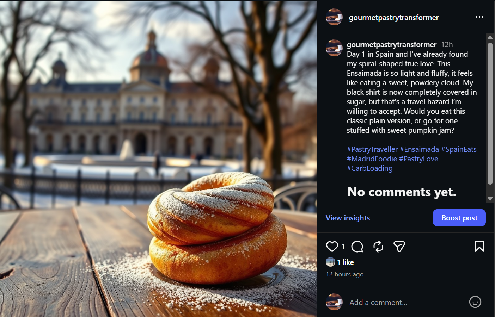

# Overview

This project publishes content generated by AI for the [@GourmetPastryTransformer](https://www.instagram.com/gourmetpastrytransformer/) Instagram account.



The script is scheduled every day and publishes a post with a caption and an image of a pastry.
Each input used to generate the content is saved so that the account fakes a food traveller. It stays in a country for a few days, then moves to a neighboring one. 

# How it works

## Daily post

A Github action (`daily-post.yml`) contains a `cron` task which schedules the main script every day at 9am .

## AI-generated content

All AI-models used in this project are free.

The text generation uses :
- HF Llama 3.3 70B
- Gemini API (gemini-3.5-flash) if HF usage limit is reached

The image generation uses :
- HF FLUX.1-schnell

Access tokens are stored in Github action secreats and created from these endpoints to call APIs : 
- HF access token: https://huggingface.co/settings/tokens
- Gemini API key: https://aistudio.google.com/api-keys

Workflow :
1. The history of the posts is loaded from a JSON filed stored in the repository
2. A new destination is chosen by the AI if it stayed enough in a country 
3. A caption and the prompt for the image generation is created
4. The image is generated
5. It is uploaded to [tmpfiles.org](https://tmpfiles.org) for hosting (static URL required for Instragram posting)

## Instagram publish

The post is created and published with API Graph for Instagram (Meta) (https://developers.facebook.com).

Steps :
1. A media container is created by using the prompt and image
2. The media container is published on the account

A [Meta app](https://developers.facebook.com/apps/) and a Facebook page were created in [Meta Business Suite](https://business.facebook.com).
Doc : https://developers.facebook.com/docs/instagram-platform/content-publishing/#create-a-container.

Access token is stored in Github secrets and created using the API Graph Tool explorer(https://developers.facebook.com/tools/explorer/) for the Instagram account with `instagram_basic`, `instagram_content_publish`, `pages_show_list`.

Since it is a short-lived token, the script exchanges it for a long-lived token (valid 60 days) at each run by calling :
```
curl "https://graph.facebook.com/v19.0/oauth/access_token
  ?grant_type=fb_exchange_token
  &client_id=YOUR_APP_ID
  &client_secret=YOUR_APP_SECRET
  &fb_exchange_token=SHORT_LIVED_TOKEN"
```

Instagram account ID can be copied from https://business.facebook.com/latest/settings/instagram_account/?business_id=1655116611586766&nav_ref=bizweb_settings_asset_linkout&selected_asset_id=106918559000956&selected_asset_type=instagram-account-v2.